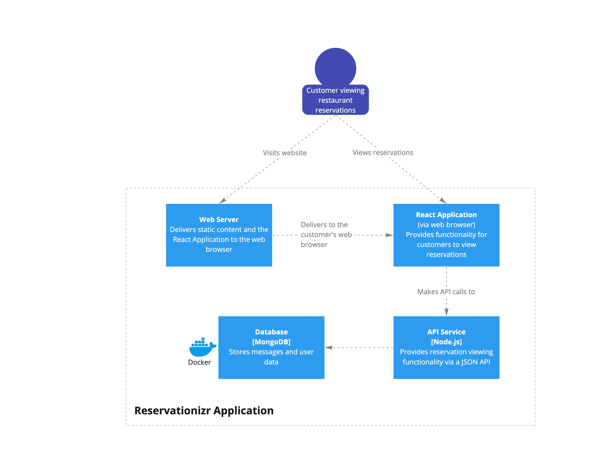
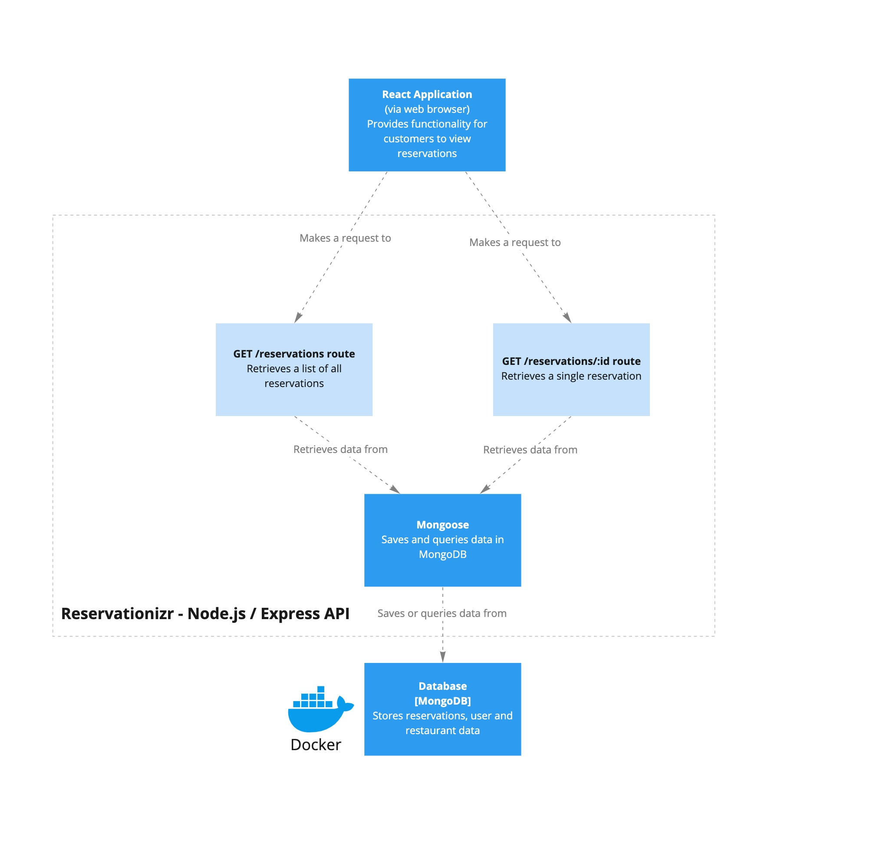
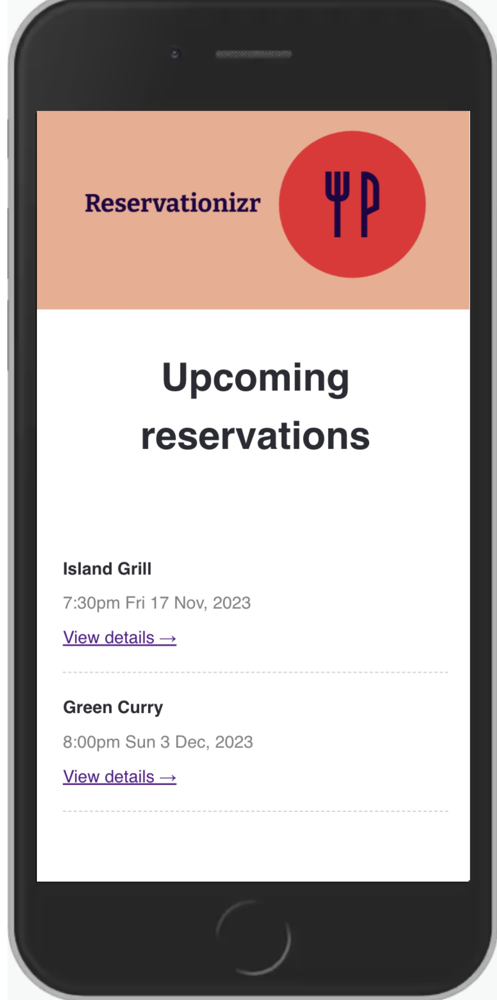
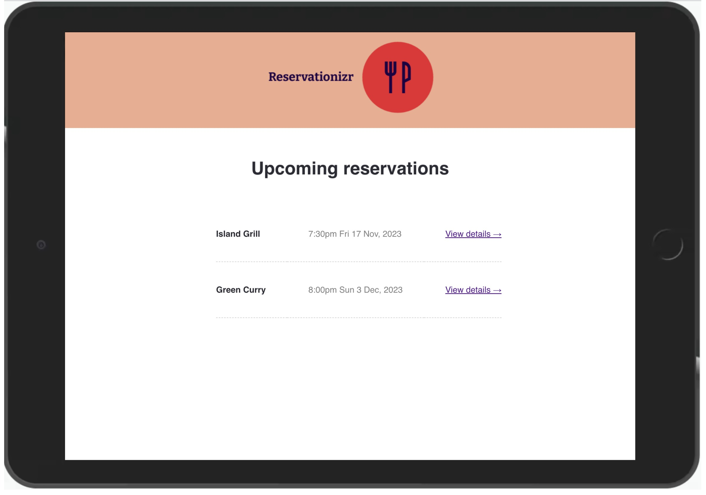
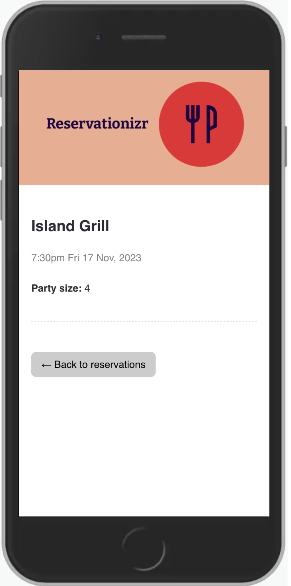
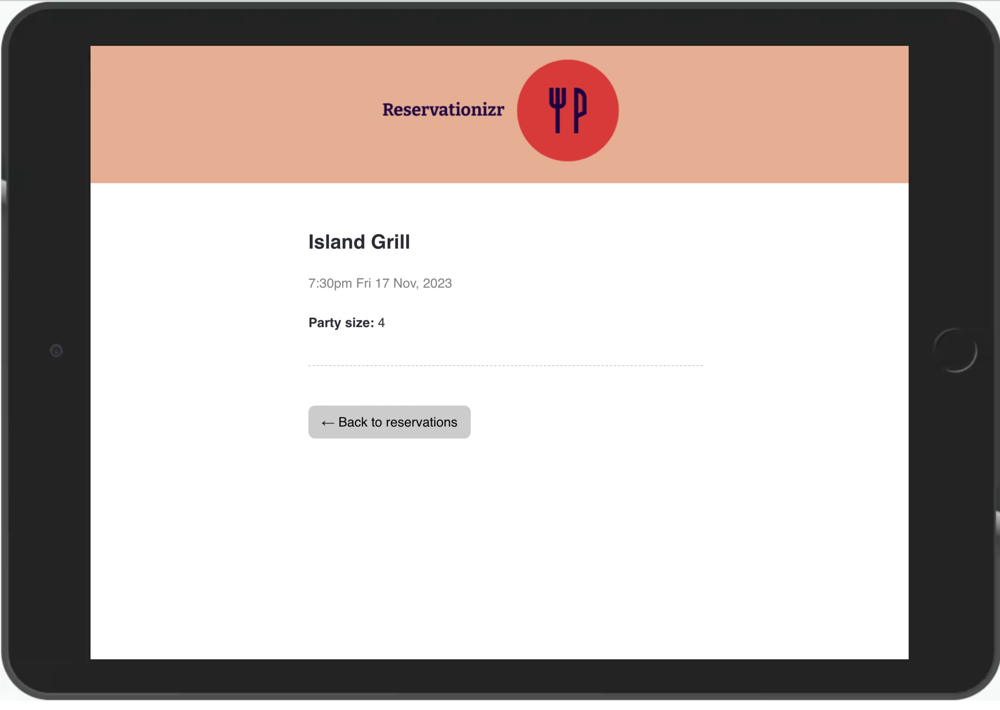

# Project - Reservationizr Application - Get requests

# Scenario

You are working for a new startup, Reservationizr. It allows customers to make reservations at any of their local restaurants from one place.

The first phase of this project involves displaying reservations on a React Application.

The previous Software Engineer started building the application but was urgently re-assigned to a different part of the business. You need to complete the remaining user stories for the initial web application, following the documentation below.

Your Tech Lead can support you if you need help understanding the requirements or are blocked with something in particular.

# Architecture diagrams





# API specification

Your API should conform to the following specification.

---

## Show Reservations

Get a list of all restaurant reservations.

**URL** : `/reservations`

**Method** : `GET`

### Success Response

**Code** : `200 OK`

**Content example**

```json
[
  {
    "id": "507f1f77bcf86cd799439011",
    "partySize": 4,
    "date": "2023-11-17T06:30:00.000Z",
    "userId": "614abe145f317b89a2e36883",
    "restaurantName": "Island Grill"
  },
  {
    "id": "614abf0a93e8e80ace792ac6",
    "partySize": 2,
    "date": "2023-12-03T07:00:00.000Z",
    "userId": "614abe145f317b89a2e36883",
    "restaurantName": "Green Curry"
  }
]
```

---

## Show Single Reservation

Get a single restaurant reservation.

**URL** : `/reservations/:id`

**URL Parameters** : `id=[string]` where `id` is the ID of the Reservation on the server.

**Method** : `GET`

### Success Response

**Code** : `200 OK`

**Content example**

Request: `GET /reservations/614abf0a93e8e80ace792ac6`

```json
{
  "id": "614abf0a93e8e80ace792ac6",
  "partySize": 2,
  "date": "2023-12-03T07:00:00.000Z",
  "userId": "614abe145f317b89a2e36883",
  "restaurantName": "Green Curry"
}
```

### Error Responses

**Condition** : If `id` parameter is an invalid id.

**Code** : `400 BAD REQUEST`

**Content** : `{ message: "id provided is invalid"}`

---

**Condition**
**Code** : `404 NOT FOUND`

**Content** : `{ message: "id not found"}`

## Getting started

The `client` folder contains the React Application, and the `server` folder contains the Express application.

### Client

- In a new Terminal window, type: `cd client` to change directory into the client folder
- Type `npm install` to install npm dependencies
- Type `npm start` to start the React Application

### Server

- In a new Terminal window, type: `cd server` to change directory into the server folder
- Type `npm install` to install npm dependencies
- Type `npm start` to start the Express Server

### MongoDB Database

- Start MongoDB in Docker by opening a terminal and `copy & paste` in the following:

```shell
docker run --name 02-project---reservationizer-application---get-requests \
-p 27017:27017 \
-v 02-project---reservationizer-application_data_container:/data/db \
-d \
mongo
```

- Connect to MongoDB using [MongoDB Compass](https://www.mongodb.com/products/compass). Create a database named `mongo`, and load data from the [data](./data) folder into the database.

### Understand what already exists

The previous developer has left you some code. Run the React Application and Express API, and navigate through the folder structures to understand what exists and where you need to write your code.

Make sure you understand what API response bodies you need to create and look at the MongoDB data schema to spot the differences. You will need to ensure you transform the MongoDB data to match the API specification.

Once you have everything up and running and have familiarised yourself with the codebase, you can complete the following user stories.

The previous developer also created a test plan, make a copy of it with the link below and ensure to add to it as you continue development.

[Reservationizr Test Plan](https://docs.google.com/spreadsheets/d/1duZOwvv4I_EyF1YLPRxexHSYeBVzrprhsYqgLOaB9Ls/copy)

---

## User Story #1 - View all reservations

- **As a** restaurant connoisseur
- **I want** to see an overview of my restaurant reservations
- **So that** I can plan my week

**Acceptance criteria**

- The Test Plan has been updated to include this User Story
- The Express route meets the API specification
- MongoDB and Mongoose are used to retrieve the data for the API response
- The code for the Express application is well tested with automated tests
- The `<ReservationList>` component in the React Application requests data from the API server and displays a list of reservations to the customer when visiting http://localhost:3000
- The design of the `<ReservationList>` component resembles the following design

  

  

---

## User Story #2 - View a single reservation

- **As a** restaurant connoisseur
- **I want** to view the details for a single restaurant reservation
- **So that** I can attend the reservation

**Acceptance criteria**

- The Test Plan has been updated to include this User Story
- The Express route meets the API specification
- MongoDB and Mongoose are used to retrieve the data for the API response
- If the `id` provided is invalid, respond with a `400` status code according to the API specification
  - Use the `validId` function in `app.js` to determine if the `id` is valid or not
- If the `id` provided cannot be found in MongoDB, respond with a `404` status code according to the API specification
- The code for the Express application is well tested with automated tests
- The `<Reservation>` component in the React Application requests data from the API server and displays a single reservation to the customer when visiting http://localhost:3000/reservations/:id (where :id is the id of the reservation)
- The design of the `<Reservation>` component resembles the following design

  

  

---

# Submit your Project

- [ ] Commits are pushed to GitHub
- [ ] Automated tests pass in GitHub
- [ ] Project is submitted in iQualify
